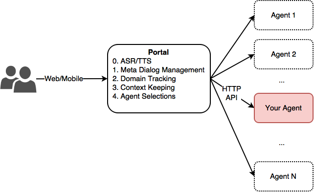
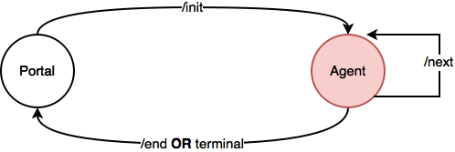
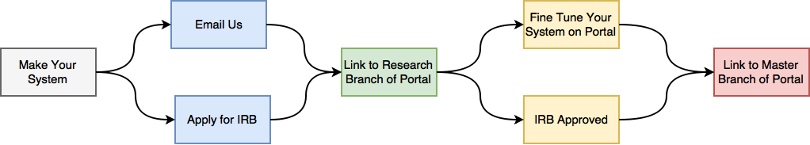

# DialPort Portal Tutorial

* [Introduction](#introduction)
* [How the portal Works](#how-the-portal-works)
* [Development Cycle](#development-cycle)
* [API Documentations:](#api-documentations)
  * [1\. Create a new session](#1-create-a-new-session)
  * [2\. Get your system's next response](#2-get-your-systems-next-response)
  * [3\. Terminate a session with your system](#3-terminate-a-session-with-your-system)
  * [Extra Parameters](#extra-parameters)
  * [Timezone](#timezone)
  * [Example Server Templates](#example-server-templates)
* [Interested in working with us?](#interested-in-working-with-us)

## Introduction
The advent of Siri and other agents has generated interest in spoken dialog research, sparking the imagination of many and leading them to believe in the usefulness of speaking to intelligent agents. The research community can profit from this interest to gather much-needed real user data by joining a general Portal that serves the general public. The Portal is the front end of several different academic dialog systems. by having many systems it is able to serve a diverse set of requests. The data gathered from the Portal can make the connected systems more robust and can be used to carry out comparative studies.

Industry has collected large data sets and sometimes retains pools of real users. They are viewed as strategic competitive resources and so are not shared with the research community. Much fundamental research still remains to be done, such as signal processing in noisy conditions’ recognition of groups of difficult users (like the elderly and non-natives), management of complex dialogs (such as multi party meetings, negotiations, and multimodal interaction), and the automatic use of meta linguistic information such as prosody.

It is difficult for any one group to collect a significant amount of real user data. The users must be found and their interest maintained. At the same time, the interface must be kept up to date. By having one data-gathering Portal that all dialog systems can connect to, the task for each participating site is easier while the portal is more interesting to potential users. Potential users find a variety of applications and can choose the ones that fulfill their needs at any given time. Also, with one central site (the Portal), only the researchers maintaining the Portal itself are tasked with attracting the users.

The DialPort Portal was created for this purpose. We welcome you to join us.

## How the portal Works

**Figure 1**

Figure 1 shows an overview about the relations between the Portal and agents. Agents here are defined as any remote dailog systems that have joined Portal. 

The Portal is responsible for facing the users via web or mobile interfaces. It will also provide the following services to all the agents:

- ASR/TTS
- Meta Dialog Management
- Domain Tracking
- Context Keeping
- Agent Selection

As for an agent, it has to implement an HTTP API server that supports 3 Portal APIs /init, /next, /end. (defined below). 

Generally speaking, the Portal and an agent will interact as follows:

1. The Portal will first interact with a user to find out what the user is interested in (*domain tracking*).
2. Portal will try to select an remote agent that matches the user's needs the best (*agent selection*).
3. Portal then starts a new remote session with the selected agent via (*/init*).
4. Portal will then pass every user utterances to the selected agent via (*/next*). The user is effectively talking to the selected agent.
5. After the selected agent decides to finish the conversation, the control is back to the Portal and we go back to *Step 1*.
6. Rarely, the remote agent does not perform well. Portal will end the session via (*/end*) and go back to *Step 1*. 

The above transitions can be compactly represented in the finite-state machine in Figure 2.

**Figure 2**

## Development Cycle

**Figure 3**

Figure 3 shows the steps that you need to take to become a part of DialPort Portal.

## API Documentations:
For a remote agent, all it needs to do is to implement the following 3 API interfaces. They are: 

1. /init
2. /next
3. /end

Very simple!

### 1. Create a new session ###

Start a new session with your dialog system. If successful, the server will return an JSON containing the session ID.

**URL**

    /init

**Method:**

   `POST`
  
**Body Data**

    { "sessionID": "USR_1234",
      "timeStamp": "yyyy-MM-dd'T'HH-mm-ss.SSS"
    }
     
**Success Response (200):** 
	
	{
	  "sessionID": "USR_1234",
	  "sys": "This word starts with A",
	  "version": "1.0-xxx",
	  "timeStamp": "yyyy-MM-dd'T'HH-mm-ss.SSS",
	  "terminal": false
	}

### 2. Get your system's next response

For an ongoing session, the portal will use this API to obtain the next system response from your dialog system.

**URL**

    /next

**Method:**

   `POST`
  
**Body Data**

	{
	    "sessionID": "USR_1234",
	    "text": "I guess the answer is APPLE", 
	    "asrConf": 0.9,
	    "timeStamp": "yyyy-MM-dd'T'HH-mm-ss.SSS"
	}
	     
**Success Response (200):** 
	
	{
	  "sessionID": "USR_1234",
	  "sys": "This word starts with A",
	  "version": "1.0-xxx",
	  "timeStamp": "yyyy-MM-dd'T'HH-mm-ss.SSS",
	  "terminal": false
	}

### 3. Terminate a session with your system ###

The portal sometimes (very rarely) wants to terminate an ongoing session with your dialog system (e.g. due to a lost connection, conversation failure etc.)

**URL**

    /end

**Method:**

   `POST`
  
**Body Data**

	{
	    "sessionID": "USR_1234",
	    "timeStamp": "yyyy-MM-dd'T'HH-mm-ss.SSS"
	}
	     
**Success Response (200):** 
	
	{
	  "sessionID": "USR_1234",
	  "sys": "Goodbye",
	  "version": "1.0-xxx",
	  "timeStamp": "yyyy-MM-dd'T'HH-mm-ss.SSS",
	  "terminal": true
	}
	
### Extra Parameters
We are open to any system expecting extra input parameters or returning extra parameters for better interaction purpose. 
Here are some example extra parameters:

Input: initial domain that user is looking for, user profile and etc.

Output: nonverbal behavior of the agent. Multimedia outputs (photo links, meta information and etc.)

### Timezone
For easier synchronization with the DialPort server logging system. Use UTC-4 timezone for all time stamps. 

### Example Server Templates
We provide server templates implemented in 3 popular frameworks for your convenience. 

Java: [JAVA Spark Framework](https://github.com/DialRC/RestMrClue)

Python: [Flask](https://github.com/DialRC/PortalAPI/tree/master/PortalAPIforPythonFlask)

Javascript: [Nodejs](https://github.com/DialRC/PortalAPI/tree/master/PortalNodeAPIs) 

## Interested in working with us?
We are happy to hear that you'd like to connect to DialPort. 

**Please read the overall process of connecting to DialPort:** 

1) Please email Dr. Maxine Eskenazi (max at cs dot cmu dot edu) and include the following description of your system :

	(An Example)
	> Organization: Carnegie Mellon University
	>
	> Contact person in your organization: Kyusong Lee (email: kyusonglee at gmail dot com)
	>
	> Domain (for example, weather, restaurants) : open domain
	>
	> Language: English
	>
	> Name of your system: Qubot
	>
	> Description: Qubot is a chat-oriented dialog system. ..... 
	>
	> Interface (Describe the interface you presently use - microphone, camera, avatar, 3D, etc.): Just a text input using keyboard.
	>
	> Keywords: chatbot, question answering, 
	>
	> Examples of utterances that your system would handle: who is the president of United States?, what is the highest mountain in the world?..,
	>
	> Schedule (when can we try your system, when could you try a connection): We would like to contribute the system in late June. Currently our system is being tested internally. 

2) When we accept to have you join the Portal, we will give the detailed explanation and some sample code for DialPort integration

3) First the system will connect to the Dev version of DialPort and be tested internally by both the DialPort team and your group. 

4) When the system is robust enough, the system will be promoted to the master version.

5) In order to be promoted to the Master version, you must demonstrate that you have IRB permission from your institution. To do this, you should contact Dr. Eskenazi and she will give you the CMU IRB application as well as the present consent form. You are repsonsible for gathering, maintaining and distributing the data corresponding to all of the dialog that users have with your system.

If you have any questions, please feel free to contact us.
